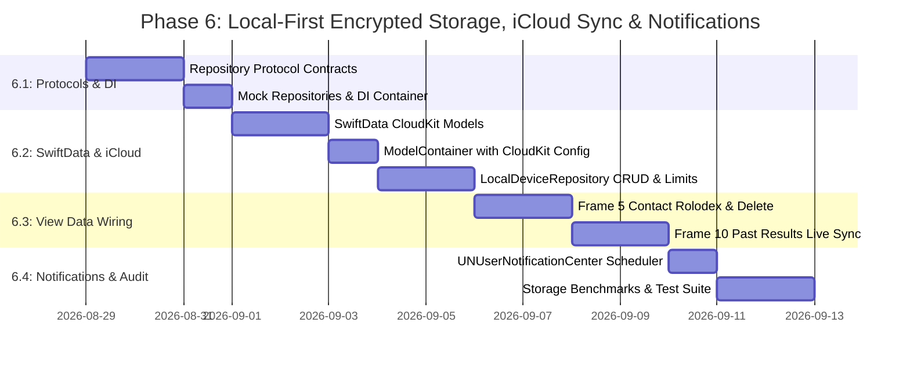

# ADR 0007: Local-First Encrypted Storage, iCloud Sync & Notification Architecture

* **Status**: Proposed
* **Date**: 2026-08-28
* **Deciders**: Lead AI Systems Architect & Mobile Engineering Team

---

## 1. Context & Architectural Problem Statement

With the completion of the 10 Figma UI frames (ADR 0005.1 through 0005.5), the CARE App features a verified, pixel-exact visual baseline. The application currently relies on in-memory mock fixtures (`Person.mockFigmaContacts`, `SurveyQuestion.full20QuestionBank`, and static results in `PastResultsView`).

To transition into a production-grade clinical wellness system while maintaining maximum user privacy, multi-device continuity, zero cloud operational overhead, and instant offline responsiveness, we establish a **local-first, zero-knowledge storage paradigm with private iCloud CloudKit synchronization**:

1. **Zero-Knowledge Privacy & Hardware Encryption**: Relationship scores, contact names, and polyvagal clinical evaluations are private and sensitive. All data resides on the user's physical device protected by Apple silicon hardware encryption (`NSFileProtectionComplete` / AES-256), and syncs across the user's trusted Apple devices using **End-to-End Encrypted (E2EE) Private CloudKit Databases** (Apple Advanced Data Protection).
2. **Predictable Storage Footprint**: The storage engine enforces a bounded ceiling (up to 50 contacts, up to 50 past assessment data points) ensuring the total storage footprint remains **under 0.5 MB ($< 500\text{ KB}$)** on disk and in the user's private iCloud container.
3. **Multi-Device Coherence & Continuity**: A user can add contacts or complete an assessment on their iPhone, and have their past results graph seamlessly update on their iPad in the background without needing a third-party account or password.
4. **User Storage Management & Erasure**: Users have first-class control to manage their storage: swipe-to-delete individual contacts, delete historical assessment data points, or perform a one-tap complete data zeroization (satisfying HIPAA/GDPR Right to Erasure across all synced devices).
5. **Offline App Updates & Bi-Weekly Reminders**:
   * App code and question catalogs update seamlessly via standard Apple App Store releases.
   * Assessment reminders operate entirely offline via iOS local notifications (`UNUserNotificationCenter`) at a bi-weekly cadence without requiring external push servers.

---

## 2. Technical Blueprint & The 4 Architectural Pillars

```
┌─────────────────────────────────────────────────────────────────────────┐
│                       SwiftUI Views (Frames 1–10)                       │
│      (HomeView, ChooseRelationshipsView, SurveyView, PastResultsView)   │
└────────────────────────────────────┬────────────────────────────────────┘
                                     │ (Dependency Injection)
                                     ▼
┌─────────────────────────────────────────────────────────────────────────┐
│                          Repository Layer                               │
│  ┌───────────────────────────┐         ┌─────────────────────────────┐  │
│  │ AssessmentRepositoryProto │         │ ContactsRepositoryProtocol  │  │
│  └─────────────┬─────────────┘         └──────────────┬──────────────┘  │
│                │                                      │                 │
│                ▼                                      ▼                 │
│  ┌───────────────────────────────────────────────────────────────────┐  │
│  │                    LocalDeviceRepository                          │  │
│  └───────────────────────────────────────────────────────────────────┘  │
└────────────────────────────────────┬────────────────────────────────────┘
                                     │
                                     ▼
┌─────────────────────────────────────────────────────────────────────────┐
│            Local Hardware-Encrypted Storage (SwiftData / SQLite)        │
│  - AES-256-GCM / XTS Hardware Encryption (NSFileProtectionComplete)     │
│  - Bounded Capacity: Max 50 Contacts, Max 50 Historical Assessments     │
│  - User Storage Management: Swipe-to-Delete & Full Purge Actions        │
│  - Local Notification Engine: UNUserNotificationCenter (Bi-Weekly)      │
└────────────────────────────────────┬────────────────────────────────────┘
                                     │ (Silent Background Sync)
                                     ▼
┌─────────────────────────────────────────────────────────────────────────┐
│                User Private iCloud Container (CloudKit)                 │
│  - Zero Third-Party Backend Infrastructure Costs                        │
│  - End-to-End Encryption via Apple Advanced Data Protection (ADP)       │
│  - Multi-Device Continuity: iPhone ↔ iPad ↔ Mac                         │
└─────────────────────────────────────────────────────────────────────────┘
```

---

### Pillar A: Hardware-Accelerated Local Encryption & iCloud Privacy Standards

#### 1. Hardware AES-256 Local Encryption (`NSFileProtectionComplete`)
* Every file and SQLite container created by the app is marked with `.completeFileProtection`.
* Data is encrypted using hardware AES-256 keys derived from the user's passcode and the device's Secure Enclave UID.
* **Locked Device Invariant**: When the device is locked, decryption keys are purged from RAM. Data cannot be accessed even if physical storage chips are analyzed.

#### 2. Private CloudKit Container & End-to-End Encryption (E2EE)
* The app syncs strictly through the user's **Private CloudKit Database** (`iCloud.com.careapp.CAREApp`).
* With Apple's **Advanced Data Protection (ADP)**, the private database is end-to-end encrypted with keys held exclusively on the user's trusted devices. Neither Apple nor the CARE App team has access to user records.
* If a user is not signed into iCloud, the app operates $100\%$ identically as an isolated, offline local store.

#### 3. Regulatory Compliance (HIPAA, GDPR, CCPA/CPRA)
* **Zero-Knowledge Architecture**: No user identifiers, contact names, or clinical evaluations ever touch external third-party cloud servers.
* **Zero Cloud Attack Surface**: Eliminates backend database leaks, authentication breaches, or SQL injection vectors.
* **Synchronized Right to Erasure**: Deleting a contact or assessment record immediately zeroes the local SQLite pages and propagates the deletion tombstone to the private iCloud container.

---

### Pillar B: Repository Protocol Architecture & Dependency Injection

SwiftUI views decouple entirely from data persistence implementations and bind strictly to protocol contracts:

```swift
// MARK: - Contacts Repository Protocol
public protocol ContactsRepositoryProtocol: Sendable {
    func fetchContacts() async throws -> [Person]
    func createContact(_ person: Person) async throws -> Person
    func updateContact(_ person: Person) async throws -> Person
    func deleteContact(id: UUID) async throws
    func fetchContactCount() async throws -> Int
}

// MARK: - Assessment Repository Protocol
public protocol AssessmentRepositoryProtocol: Sendable {
    func fetchQuestionBank() async throws -> [SurveyQuestion]
    func saveAssessmentResult(_ result: AssessmentResult) async throws
    func fetchAssessmentHistory() async throws -> [AssessmentResult]
    func deleteAssessmentResult(id: UUID) async throws
    func clearAllHistory() async throws
    func fetchHistoryCount() async throws -> Int
}

// MARK: - Notification Manager Protocol
public protocol NotificationSchedulerProtocol: Sendable {
    func requestAuthorization() async throws -> Bool
    func scheduleBiWeeklyReminder(preferredHour: Int, preferredWeekday: Int) async throws
    func cancelReminders() async throws
    func isReminderScheduled() async throws -> Bool
}

// MARK: - CloudKit Sync Status Publisher
public enum SyncStatus: Sendable {
    case synced
    case syncing
    case offline
    case iCloudDisabled
}
```

#### Dual-Mode Implementation Strategy
* **`MockAssessmentRepository` / `MockContactsRepository`**: Retained for ultra-fast, deterministic unit testing (`CAREAppTests`) and SwiftUI Previews without disk I/O.
* **`LocalDeviceRepository`**: Production repository backed by encrypted SwiftData storage with automatic background CloudKit sync.

---

### Pillar C: SwiftData CloudKit-Compliant Schema & Storage Management

#### 1. SwiftData CloudKit-Compliant Models
CloudKit requires all properties to have default values or be optional, and relationships must be optional for conflict-free merge operations:

```swift
import SwiftData
import Foundation

@Model
public final class StoredContact {
    public var id: UUID = UUID()
    public var name: String = ""
    public var initials: String = ""
    public var categoryRaw: String = "partner"
    public var age: Int = 30
    public var createdAt: Date = Date()
    
    public init(
        id: UUID = UUID(),
        name: String = "",
        initials: String = "",
        categoryRaw: String = "partner",
        age: Int = 30,
        createdAt: Date = Date()
    ) {
        self.id = id
        self.name = name
        self.initials = initials
        self.categoryRaw = categoryRaw
        self.age = age
        self.createdAt = createdAt
    }
}

@Model
public final class StoredAssessmentSession {
    public var id: UUID = UUID()
    public var date: Date = Date()
    public var totalScore: Double = 0.0
    public var overallTierRaw: String = "healthy"
    public var safePercentage: Double = 0.0
    public var moderatePercentage: Double = 0.0
    public var highRiskPercentage: Double = 0.0
    public var calmScore: Double = 0.0
    public var acceptedScore: Double = 0.0
    public var resonantScore: Double = 0.0
    public var energeticScore: Double = 0.0
    
    @Relationship(deleteRule: .cascade)
    public var participants: [StoredParticipantResult]? = []
    
    public init(
        id: UUID = UUID(),
        date: Date = Date(),
        totalScore: Double = 0.0,
        overallTierRaw: String = "healthy",
        safePercentage: Double = 0.0,
        moderatePercentage: Double = 0.0,
        highRiskPercentage: Double = 0.0,
        calmScore: Double = 0.0,
        acceptedScore: Double = 0.0,
        resonantScore: Double = 0.0,
        energeticScore: Double = 0.0,
        participants: [StoredParticipantResult] = []
    ) {
        self.id = id
        self.date = date
        self.totalScore = totalScore
        self.overallTierRaw = overallTierRaw
        self.safePercentage = safePercentage
        self.moderatePercentage = moderatePercentage
        self.highRiskPercentage = highRiskPercentage
        self.calmScore = calmScore
        self.acceptedScore = acceptedScore
        self.resonantScore = resonantScore
        self.energeticScore = energeticScore
        self.participants = participants
    }
}

@Model
public final class StoredParticipantResult {
    public var id: UUID = UUID()
    public var personName: String = ""
    public var initials: String = ""
    public var percentTimeSpent: Double = 0.20
    public var individualScore: Double = 0.0
    public var safetyTierRaw: String = "Safe"
    public var calmScore: Double = 0.0
    public var acceptedScore: Double = 0.0
    public var resonantScore: Double = 0.0
    public var energeticScore: Double = 0.0
    
    public init(
        id: UUID = UUID(),
        personName: String = "",
        initials: String = "",
        percentTimeSpent: Double = 0.20,
        individualScore: Double = 0.0,
        safetyTierRaw: String = "Safe",
        calmScore: Double = 0.0,
        acceptedScore: Double = 0.0,
        resonantScore: Double = 0.0,
        energeticScore: Double = 0.0
    ) {
        self.id = id
        self.personName = personName
        self.initials = initials
        self.percentTimeSpent = percentTimeSpent
        self.individualScore = individualScore
        self.safetyTierRaw = safetyTierRaw
        self.calmScore = calmScore
        self.acceptedScore = acceptedScore
        self.resonantScore = resonantScore
        self.energeticScore = energeticScore
    }
}
```

#### 2. Multi-Device Conflict Resolution Policy
* **Assessment Sessions**: Append-only historical entries with unique timestamps. Conflicts are naturally $0\%$.
* **Contacts Rolodex**: Resolved using **Last-Write-Wins (LWW)** based on CloudKit record change tags (`recordChangeTag`).

#### 3. User Storage Management & Deletion Controls
* **Bounded Ceiling Guard**: 
  * Maximum 50 contacts in Rolodex.
  * Maximum 50 historical assessment data points in Past Results.
* **Frame 5 (`ChooseRelationshipsView`)**:
  * Swipe-to-delete action on contact pills.
  * Add custom contact modal.
* **Frame 10 (`PastResultsView`)**:
  * Swipe-to-delete action on historical accordion cards.
  * Instant recalculation of trendline charts when a past session is removed.
* **Data Management / Storage Readout Modal**:
  * Real-time storage meter: `"Storage Used: 214 KB (18 / 50 assessments stored) • Synced with iCloud"`.
  * Single-tap `"Delete All Assessment History"` button with confirmation prompt.

---

### Pillar D: Bi-Weekly Local Notification Engine (`UNUserNotificationCenter`)

* **Zero Backend Dependency**: Scheduled locally on the user's device via `UserNotifications.framework`.
* **Bi-Weekly Repeating Cadence**:
  * Trigger: `UNCalendarNotificationTrigger` repeating every 14 days (e.g. every second Sunday at 7:00 PM).
  * Notification Content:
    * Title: `C.A.R.E. Check-In`
    * Body: `🌱 Time for your bi-weekly Relational Safety check-in. Tap to reflect on your connections.`
* **Settings Control**: User can toggle reminders on/off and select their preferred time/day.

---

## 3. Back-of-the-Envelope Storage Footprint Calculation

```
┌──────────────────────────────────────┬──────────────────────┬──────────────────────┐
│ Entity / Component                   │ Per-Item Size        │ 50-Item Total        │
├──────────────────────────────────────┼──────────────────────┼──────────────────────┤
│ 1. Contacts Rolodex (50 contacts)    │ ~100 bytes           │ ~5 KB                │
│ 2. Assessment Summaries (50 sessions)│ ~480 bytes           │ ~24 KB               │
│ 3. Question Answers (100 answers/ea) │ ~2.0 KB              │ ~100 KB              │
│ 4. SwiftData / SQLite B-Tree Index   │ Overhead & WAL log   │ ~150 KB              │
├──────────────────────────────────────┼──────────────────────┼──────────────────────┤
│ TOTAL USER DATA FOOTPRINT            │                      │ ~279 KB (< 0.3 MB!)  │
└──────────────────────────────────────┴──────────────────────┴──────────────────────┘
```

> **Conclusion**: Even after **10 years of continuous weekly usage** (520 sessions), total user data remains **under 1.5 MB**, occupying a negligible fraction of the user's device storage and free 5 GB iCloud tier.

---

## 4. Phased Implementation Roadmap



### Stage 6.1: Repository Protocol Contracts & Dependency Injection
* Define `ContactsRepositoryProtocol`, `AssessmentRepositoryProtocol`, and `NotificationSchedulerProtocol` under `ios/CAREApp/Repositories/`.
* Create `AppEnvironment` container for injecting repositories into the SwiftUI view hierarchy.
* Wire existing views to repository protocols using mock implementations.

### Stage 6.2: SwiftData Models & CloudKit-Backed Local Device Repository
* Create `StoredContact`, `StoredAssessmentSession`, and `StoredParticipantResult` models conforming to CloudKit requirements.
* Initialize `ModelContainer` with `.completeFileProtection` and `ModelConfiguration(cloudKitDatabase: .private)`.
* Configure `iCloud.com.careapp.CAREApp` container capability in `CAREApp.xcodeproj`.
* Implement `LocalDeviceRepository` with automatic 50-item ceiling enforcement.

### Stage 6.3: View Data Wiring & User Deletion Controls
* Connect **Frame 5 (`ChooseRelationshipsView`)** to `ContactsRepository` with add/edit/swipe-to-delete actions.
* Connect **Frame 7 & 8 (`SurveyQuestionView` / `SurveyResultsView`)** to save new completed assessments.
* Connect **Frame 10 (`PastResultsView`)** to `AssessmentRepository.fetchAssessmentHistory()` with swipe-to-delete accordion support.
* Add Storage Management modal with storage readout and full history purge.

### Stage 6.4: Bi-Weekly Local Notification Scheduler
* Implement `NotificationService` conforming to `NotificationSchedulerProtocol`.
* Configure 14-day repeating `UNCalendarNotificationTrigger`.
* Add notification permission request and reminder settings toggle in the app.

### Stage 6.5: Automated Testing & Storage Benchmarking
* Unit test suite (`CAREAppTests`) verifying CRUD operations, storage limits, and cascade deletions.
* Storage benchmark test verifying memory & disk footprint stays strictly $< 1\text{ MB}$.
* XCUITest verifying swipe-to-delete and notification permission workflows.

---

## 5. Consequences & Benefits

* **Multi-Device Continuity**: Automatic background synchronization between iPhone, iPad, and Mac via the user's private iCloud account.
* **Zero Cloud Hosting Cost**: Zero backend servers, cloud databases, or API maintenance fees.
* **Instantaneous Response Times**: All queries, saves, and trendline chart renders execute in $< 5\text{ms}$ locally.
* **Maximum Privacy & HIPAA Alignment**: Sensitive relational evaluations remain strictly within the user's hardware-encrypted Secure Enclave and End-to-End Encrypted iCloud container.
* **Full Offline Resilience**: Complete functionality without an active internet connection.
