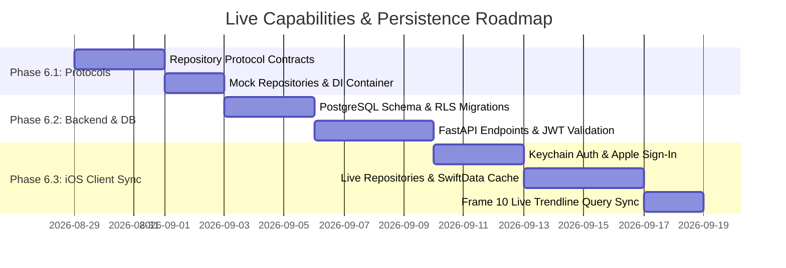

# ADR 0007: User Accounts, Authentication, Repository Pattern & Cloud Persistence

* **Status**: Proposed
* **Date**: 2026-08-28
* **Deciders**: Lead AI Systems Architect & Mobile/Backend Engineering Team

---

## 1. Context & Architectural Problem Statement

With the completion of the 10 Figma UI frames (ADR 0005.1 through 0005.5), the CARE App frontend features a complete, pixel-exact visual baseline. However, the application currently relies on in-memory mock data (`Person.mockFigmaContacts`, `SurveyQuestion.full20QuestionBank`, static trend history in `PastResultsView`).

To transition the application into a production-grade clinical wellness system, we must resolve:
1. **User Identity & Privacy**: Secure authentication meeting App Store guidelines (Sign in with Apple), biometric protection for sensitive relationship scores, and anonymous guest onboarding with zero drop-off.
2. **Repository Decoupling**: Removing hardcoded static models from SwiftUI views and injecting data through protocol-based repositories (`AssessmentRepositoryProtocol`, `ContactsRepositoryProtocol`, `UserRepositoryProtocol`).
3. **Offline-First Resilience**: Ensuring users can complete assessments in offline/airplane modes with local persistence (SwiftData) that synchronizes with the cloud backend upon reconnection.
4. **Cloud Persistence & Multi-Tenant Security**: Storing historical assessments, relational safety breakdowns, and contact networks in PostgreSQL with Row-Level Security (RLS) and HIPAA-aligned data isolation.

---

## 2. Decision & Technical Blueprint

We establish a 4-pillar persistence and identity architecture:

```
┌─────────────────────────────────────────────────────────────────────────┐
│                       SwiftUI Views (Frames 1–10)                       │
└────────────────────────────────────┬────────────────────────────────────┘
                                     │ (Dependency Injection)
                                     ▼
┌─────────────────────────────────────────────────────────────────────────┐
│                          Repository Layer                               │
│  ┌───────────────────────────┐         ┌─────────────────────────────┐  │
│  │ AssessmentRepositoryProto │         │ ContactsRepositoryProtocol  │  │
│  └─────────────┬─────────────┘         └──────────────┬──────────────┘  │
└────────────────┼──────────────────────────────────────┼─────────────────┘
                 │                                      │
                 ▼                                      ▼
┌─────────────────────────────────────────────────────────────────────────┐
│                   Offline-First Cache & Sync Engine                     │
│  - SwiftData Local Store (Encrypted with FileProtectionComplete)        │
│  - Conflict Resolution: Client-Wins for local drafts, Server-Timestamp  │
└────────────────────────────────────┬────────────────────────────────────┘
                                     │ (Async HTTPS / JWT Auth)
                                     ▼
┌─────────────────────────────────────────────────────────────────────────┐
│               Backend Cloud Services (FastAPI + PostgreSQL)              │
│  - Sign in with Apple / Supabase Auth JWT Verification                  │
│  - Row-Level Security (RLS) on PostgreSQL 16                            │
│  - pgvector Semantic Retrieval Engine                                   │
└─────────────────────────────────────────────────────────────────────────┘
```

---

### Pillar A: Authentication & Identity Management

#### 1. Supported Authentication Providers
* **Sign in with Apple (Primary)**:
  * Mandatory for iOS apps offering third-party logins.
  * Preserves user privacy via Apple Private Email Relay.
  * Uses `AuthenticationServices` framework and passes the Apple identity token (`ASAuthorizationAppleIDCredential`) to the backend for cryptographic JWT verification.
* **Anonymous Guest Onboarding (Zero-Friction)**:
  * Users can immediately start an assessment without an upfront registration wall.
  * Generates an anonymous device-scoped UUID.
  * When the user completes the assessment and views results, an in-app banner prompts: *"Create an account to securely save and track your relational safety over time"*, seamlessly migrating local session data to the authenticated profile.

#### 2. Secure Token Storage
* JWT Access Tokens (short-lived, 1 hour) and Refresh Tokens (30 days) are stored strictly in the **iOS Keychain** using the `kSecClassGenericPassword` security class with `kSecAttrAccessibleAfterFirstUnlockThisDeviceOnly`.
* Tokens are **never** stored in `UserDefaults` or unencrypted plists.

---

### Pillar B: Repository Protocol Architecture

Views will interact exclusively with protocol abstractions rather than concrete models:

```swift
// MARK: - Contacts Repository Protocol
public protocol ContactsRepositoryProtocol: Sendable {
    func fetchContacts() async throws -> [Person]
    func createContact(_ person: Person) async throws -> Person
    func updateContact(_ person: Person) async throws -> Person
    func deleteContact(id: UUID) async throws
    func importDeviceContacts() async throws -> [Person]
}

// MARK: - Assessment Repository Protocol
public protocol AssessmentRepositoryProtocol: Sendable {
    func fetchQuestionBank() async throws -> [SurveyQuestion]
    func submitAssessment(_ session: AssessmentSessionState) async throws -> AssessmentResult
    func fetchAssessmentHistory() async throws -> [AssessmentResult]
    func fetchAssessment(id: UUID) async throws -> AssessmentResult?
}

// MARK: - User Profile & Streak Repository Protocol
public protocol UserRepositoryProtocol: Sendable {
    func getCurrentUser() async throws -> UserProfile
    func fetchDailyStreak() async throws -> Int
    func updateProfile(displayName: String) async throws -> UserProfile
}
```

#### Dual-Mode Implementation Strategy
* **`MockAssessmentRepository`**: Loaded during SwiftUI Previews, unit tests, and offline demo environments. Uses deterministic mock data without network calls.
* **`LiveAssessmentRepository`**: Loaded in production. Queries local SwiftData cache first, dispatching asynchronous sync tasks to the FastAPI backend.

---

### Pillar C: Database Schema & Cloud Persistence (PostgreSQL + RLS)

```sql
-- 1. Profiles Table
CREATE TABLE public.profiles (
    id UUID PRIMARY KEY REFERENCES auth.users(id) ON DELETE CASCADE,
    email TEXT,
    display_name TEXT,
    streak_count INT DEFAULT 0,
    last_assessment_at TIMESTAMPTZ,
    created_at TIMESTAMPTZ DEFAULT NOW(),
    updated_at TIMESTAMPTZ DEFAULT NOW()
);

-- Enable Row-Level Security
ALTER TABLE public.profiles ENABLE ROW LEVEL SECURITY;
CREATE POLICY "Users can only access their own profile"
    ON public.profiles FOR ALL
    USING (auth.uid() = id);

-- 2. Relationships (Rolodex) Table
CREATE TABLE public.relationships (
    id UUID PRIMARY KEY DEFAULT gen_random_uuid(),
    user_id UUID NOT NULL REFERENCES public.profiles(id) ON DELETE CASCADE,
    name TEXT NOT NULL,
    initials TEXT NOT NULL,
    category TEXT NOT NULL CHECK (category IN ('partner', 'family', 'friend', 'coworker', 'custom')),
    age INT,
    created_at TIMESTAMPTZ DEFAULT NOW()
);

ALTER TABLE public.relationships ENABLE ROW LEVEL SECURITY;
CREATE POLICY "Users can only manage their own contacts"
    ON public.relationships FOR ALL
    USING (auth.uid() = user_id);

-- 3. Assessment Sessions Table
CREATE TABLE public.assessment_sessions (
    id UUID PRIMARY KEY DEFAULT gen_random_uuid(),
    user_id UUID NOT NULL REFERENCES public.profiles(id) ON DELETE CASCADE,
    total_score NUMERIC(5,2) NOT NULL,
    overall_tier TEXT NOT NULL CHECK (overall_tier IN ('healthy', 'moderate', 'highRisk')),
    safe_percentage NUMERIC(5,4) NOT NULL,
    moderate_percentage NUMERIC(5,4) NOT NULL,
    high_risk_percentage NUMERIC(5,4) NOT NULL,
    calm_score NUMERIC(5,2) NOT NULL,
    accepted_score NUMERIC(5,2) NOT NULL,
    resonant_score NUMERIC(5,2) NOT NULL,
    energetic_score NUMERIC(5,2) NOT NULL,
    created_at TIMESTAMPTZ DEFAULT NOW()
);

ALTER TABLE public.assessment_sessions ENABLE ROW LEVEL SECURITY;
CREATE POLICY "Users can only access their own assessment sessions"
    ON public.assessment_sessions FOR ALL
    USING (auth.uid() = user_id);

-- 4. Assessment Participants Table
CREATE TABLE public.assessment_participants (
    id UUID PRIMARY KEY DEFAULT gen_random_uuid(),
    session_id UUID NOT NULL REFERENCES public.assessment_sessions(id) ON DELETE CASCADE,
    relationship_id UUID REFERENCES public.relationships(id) ON DELETE SET NULL,
    person_name TEXT NOT NULL,
    percent_time_spent NUMERIC(5,4) NOT NULL,
    individual_score NUMERIC(5,2) NOT NULL,
    safety_tier TEXT NOT NULL,
    calm_score NUMERIC(5,2),
    accepted_score NUMERIC(5,2),
    resonant_score NUMERIC(5,2),
    energetic_score NUMERIC(5,2)
);

ALTER TABLE public.assessment_participants ENABLE ROW LEVEL SECURITY;
CREATE POLICY "Users can only view their own participants"
    ON public.assessment_participants FOR ALL
    USING (session_id IN (SELECT id FROM public.assessment_sessions WHERE user_id = auth.uid()));
```

---

### Pillar D: API Endpoint Specifications (FastAPI)

| Method | Endpoint | Description | Auth Required |
| :--- | :--- | :--- | :---: |
| `POST` | `/api/v1/auth/apple` | Verifies Apple Identity Token and issues session JWT | No |
| `GET` | `/api/v1/users/me` | Fetches authenticated profile and streak count | Yes |
| `GET` | `/api/v1/contacts` | Fetches user's relationship rolodex | Yes |
| `POST` | `/api/v1/contacts` | Creates a new contact in rolodex | Yes |
| `GET` | `/api/v1/questions` | Fetches active question bank with domain multipliers | Optional |
| `POST` | `/api/v1/assessments/submit` | Submits completed session and stores score breakdowns | Yes |
| `GET` | `/api/v1/assessments/history` | Fetches historical trend results for Frame 10 charts | Yes |

---

## 3. Phased Implementation Roadmap



### Stage 1: Protocol & Dependency Injection Setup
* Define `ContactsRepositoryProtocol`, `AssessmentRepositoryProtocol`, and `UserRepositoryProtocol` under `ios/CAREApp/Repositories/`.
* Wrap existing mock data inside `MockContactsRepository` and `MockAssessmentRepository`.
* Inject repositories into `AppEnvironment` / SwiftUI environment without modifying view visual hierarchies.

### Stage 2: Database Migrations & FastAPI Backend Endpoints
* Apply PostgreSQL migrations using `asyncpg` and Supabase SQL runner.
* Implement FastAPI routers for `/auth`, `/contacts`, `/questions`, and `/assessments`.
* Implement server-side clinical scoring verification inside `backend/` to prevent client tampering.

### Stage 3: Sign in with Apple & iOS Keychain Manager
* Add `AuthenticationServices` integration to iOS app.
* Implement `KeychainService` for storing and refreshing session JWTs.
* Provide guest-to-account auto-migration.

### Stage 4: SwiftData Offline Cache & Live Data Wiring
* Replace static `Person.mockRolodex` in Frame 5 with live contacts repository.
* Replace static trend points in Frame 10 with live historical results from `AssessmentRepository.fetchAssessmentHistory()`.
* Add optional Apple Contacts framework import (`CNContactStore`).

---

## 4. Consequences & Benefits

* **Zero View Disruption**: The UI remains 100% faithful to the Figma designs while gaining enterprise-grade persistence.
* **HIPAA-Aligned Privacy**: User relationship scores and polyvagal clinical evaluations are shielded behind Row-Level Security, Apple Private Relay, and optional biometric Face ID locks.
* **Offline Resilience**: Users can complete assessments uninterrupted in offline environments, with seamless background synchronization.
* **Testability**: Unit tests and previews continue running at ultra-high speed using `MockAssessmentRepository` without needing live network access.
