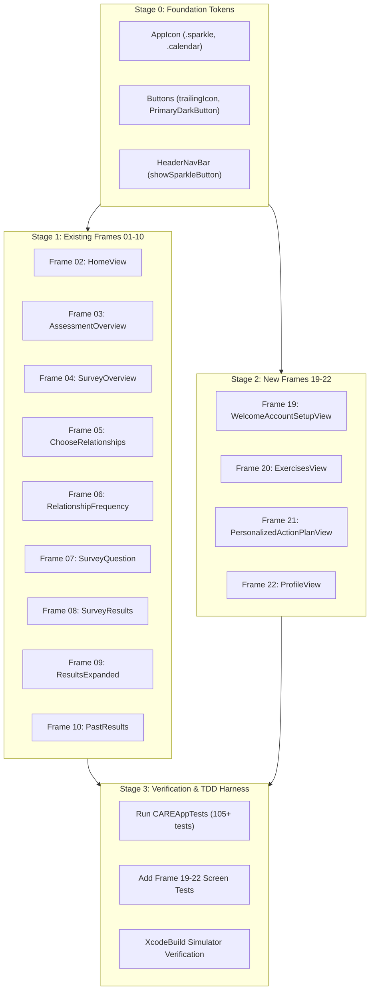

# ADR 0011: Figma Design System Updates & Exercises Module Integration Architecture

* **Status**: Accepted / Implemented (Directives #1–17 Completed & Verified with 111 Unit Tests + 6 UI Tests; Visual Pixel-Matching Staged)
* **Date**: 2026-09-20
* **Deciders**: Lead AI Systems Architect, Mobile Engineering Team, Product Design (Jayme)
* **Figma File**: `C.A.R.E. App` (Key: `4uqL8l0VygkDoFQeXP7VeL`)
* **Design Handoff Scope**:
  * 10 Updated Assessment & Dashboard Frames (Frames 01–10)
  * 4 Brand-New Application Screens (Frames 19–22)
  * Jayme's 17 Canvas UI Directives (Figma Nodes `211:59` through `239:8`, Frames `241:467`, `241:492`, `244:470`)

---

## 1. Context & Motivation

Following the successful implementation and verification of the Core Assessment engine (ADR 0005), Local-First Persistence & Sync (ADR 0007), Biometric App Lock (ADR 0008), and Psychoeducation & Clinical Neuroscience Module (ADR 0009), the mobile client maintains **105 passing tests across 18 test suites**.

Jayme has delivered a major design system refinement in Figma file `4uqL8l0VygkDoFQeXP7VeL`. Her updates encompass:
1. **12 Concrete UI Directives** (Figma Node `211:59`) refining existing assessment headers, subtitles, button positioning, and icon alignments.
2. **4 Brand-New Application Screens**:
   * `welcome-account-setup` (Node `213:4` | Frame 19)
   * `exercises-screen` (Node `214:4` | Frame 20)
   * `personalized-action-plan` (Node `215:5` | Frame 21)
   * `profile-page` (Node `218:4` | Frame 22)
3. **Canvas Routing Context**: On the Figma canvas, Jayme placed these exercise and onboarding screens on Page 1 (`[Done] Assessment & Homepage`, Node `0:1`) rather than the empty Page 3 (`Exercises`, Node `199:3`). In the application architecture, routing will remain cleanly decoupled under `AppRoute.exercises` and `ExercisesView`.

This ADR establishes the complete frame-by-frame integration plan, non-regression invariants, and testable acceptance criteria to govern the implementation run once hand inspection is complete.

---

## 2. Non-Regression Invariants

All changes must strictly preserve existing application features and pass all 105 tests:

1. **Assessment State Machine**: `AssessmentSessionState` answer tracking, `hasAnswerForCurrentQuestion`, `canAdvance`, multi-participant iteration, and dynamic button titles ("Next", "Next: {Name}", "Complete Assessment") must remain completely unmodified.
2. **Scoring Engine Integrity**: `FlexibleScoringEngine` domain score normalizations, clinical cutoffs (Safe $\ge 75$, Moderate 60–74, High Risk $< 60$), and `DonutChartView` angular geometry ($360.0^\circ \pm 0.001^\circ$) must remain byte-identical.
3. **Local-First Persistence**: SwiftData models (`StoredContact`, `StoredAssessmentSession`), CloudKit sync invariants, auto-pruning 50-session ceilings, and right-to-erasure GDPR/CCPA purges must not be broken.
4. **Search & Analytics**: `FuzzyMatcher` typo-tolerant candidate scoring, multi-series historical trendlines (`CARETrendChart`), and swipeable contact cards (`PageIndicatorDots`) must continue to render correctly.
5. **Swift 6 Strict Concurrency**: All views, components, and routers must compile with 0 warnings under Swift 6 strict concurrency (`@Observable`, `@MainActor`, `Sendable`).

---

## 3. Global Component & Design Token Enhancements

### A. Navigation Bar Sparkle & Calendar Icons (`HeaderNavBar.swift` & `AppIcon.swift`)
* Import Figma node `232:15` directly into `Assets.xcassets/icon_calendar.imageset/` and register `.calendar` in `AppIcon.swift`.
* Register `.sparkle` in `AppIcon.swift` with consistent 36x36 circular button styling (`CircularNavIconButton`).
* Update `HeaderNavBar.swift` with configurable sparkle button positioning:
  * **On Homepage (`HomeView`)**: Placed in the left cluster next to the Home pill / icon, matching the 8–10 pt horizontal spacing used between the stats and profile icons on the right.
  * **On Funnel Screens**: Placed in the right cluster alongside chart and profile icons.
  * **Excluded**: `LoadingView` and `PersonalizedActionPlanView`.
* Tapping the sparkle icon always routes to `AppRoute.personalizedActionPlan`.

### B. Standardized Primary & Secondary Button Icons (`Buttons.swift`)
* Extend `PrimaryButton` to support `trailingIcon: String?` (for right-facing arrows `arrow.right` on "Next" CTAs).
* Extend `PrimaryButton` and `SecondaryButton` to support centered text with leading icon (for `← Back to Results` and `← Return to Exercises`).
* Introduce `PrimaryDarkButton` for dark navy `#1E293B` buttons ("Unlock Full Book Exercises").
* Ensure all buttons preserve $\ge 44\text{ pt}$ HIG touch targets and haptic feedback.

### C. Universal Pinned "Sticky Bottom Action Bar" Pattern
Replace inline `ScrollView` buttons with a pinned bottom container:
```swift
VStack(spacing: 0) {
    HeaderNavBar(...)
    ScrollView {
        content
            .padding(.horizontal, 20)
            .padding(.bottom, 24)
    }
    .frame(maxWidth: .infinity, maxHeight: .infinity)
    
    // Pinned above Home Indicator
    VStack(spacing: 8) {
        PrimaryButton(...)
    }
    .padding(.horizontal, 20)
    .padding(.vertical, 12)
    .background(Theme.Colors.background.ignoresSafeArea(edges: .bottom))
}
```

---

## 4. Master Frame Catalog (22 Frames)

```
┌──────────────────────────────────────────────────────────────────────────────────────────────────┐
│                             CARE App Master Frame Catalog (22 Frames)                            │
├─────────┬───────────────────────────────────────────┬──────────────┬─────────────┬───────────────┤
│ Frame # │ Frame Name                                │ Dimensions   │ Scope       │ Render File   │
├─────────┼───────────────────────────────────────────┼──────────────┼─────────────┼───────────────┤
│ 01      │ Loading Screen                            │ 390 × 844    │ Assessment  │ 01_loading..  │
│ 02      │ homepage                                  │ 390 × 844    │ Assessment  │ 02_homepage.. │
│ 03      │ assessment-overview                       │ 390 × 1045   │ Assessment  │ 03_assessment │
│ 04      │ survey-overview                           │ 390 × 844    │ Assessment  │ 04_survey_ov..│
│ 05      │ choose-relationships                      │ 390 × 844    │ Assessment  │ 05_choose_re..│
│ 06      │ relationship-frequency                    │ 390 × 844    │ Assessment  │ 06_relationsh.│
│ 07      │ survey-question                           │ 390 × 844    │ Assessment  │ 07_survey_qu..│
│ 08      │ survey-results                            │ 390 × 1842   │ Assessment  │ 08_survey_re..│
│ 09      │ survey-results-expanded                   │ 390 × 941    │ Assessment  │ 09_survey_re..│
│ 10      │ past-results                              │ 390 × 1467   │ Assessment  │ 10_past_resu..│
│ 11–18   │ Psychoeducation Module (8 Frames)         │ Multi        │ Education   │ 11_education..│
│ 19      │ welcome-account-setup                     │ 390 × 844    │ Account     │ 19_welcome_a..│
│ 20      │ exercises-screen                          │ 390 × 844    │ Exercises   │ 20_exercises..│
│ 21      │ personalized-action-plan                  │ 390 × 844    │ Action Plan │ 21_personali..│
│ 22      │ profile-page                              │ 390 × 844    │ Account     │ 22_profile_p..│
└─────────┴───────────────────────────────────────────┴──────────────┴─────────────┴───────────────┘
```

---

## 5. Frame-by-Frame Implementation & Acceptance Criteria

### Frame 01: Loading Screen (`3:2` | `01_loading_screen_frame_3_2.png`)
* **Inspection Status**: Identical to original design. No UI or layout changes required.
* **Asset Tracking**: Single canonical render retained as `docs/figma_frames/01_loading_screen_frame_3_2.png`.
* **Implementation Plan**: No code modifications needed. `LoadingView.swift` remains untouched.
* **Acceptance Criteria**:
  - [x] Canonical frame `01_loading_screen_frame_3_2.png` retained; redundant updated clone removed.
  - [x] Zero changes to `LoadingView.swift` logic or animation timing.
  - [x] `TEST-SCR-01` passes.

---

### Frame 02: Homepage & Dashboard (`5:4` | `02_homepage_frame_5_4.png`)
* **Inspection Status**: Implemented and verified on iOS Simulator. Retaining canonical render as `docs/figma_frames/02_homepage_frame_5_4.png`.
* **Key Architecture & Design Requirements**:
  1. **Direct Calendar Icon Asset Import**:
     * Extract Figma node `232:15` (`calendar-icon`) directly from Figma REST API at native vector / `@2x` / `@3x` resolution.
     * Store as a bundled asset in `Assets.xcassets/icon_calendar.imageset/` alongside existing icons (`icon_sparkles`, `icon_book_open`, `icon_heart_pulse`, `icon_activity`).
     * Expose through `AppIcon.calendar` and standalone `CalendarIcon` as a reusable component with `AppIcon_calendar` identifier and `"Calendar"` accessibility label.
  2. **Header Sparkle Icon Placement**:
     * Add the circular sparkle icon button (`AppIcon.sparkle`) into the **left header cluster next to the Home icon / pill**.
     * Enforce the exact same horizontal spacing (8–10 pt) that the stats (chart) and profile buttons have from each other on the right.
     * Tapping the sparkle icon navigates to `AppRoute.personalizedActionPlan`.
  3. **Assessment Interval Badge**:
     * In `StreakBadgeView` (or renamed `AssessmentIntervalBadgeView`), replace the previous sparkles icon with the new imported `calendar-icon`.
     * Update text to `"Days until next assessment: 3 days"`.
     * Horizontally center the icon and label within the 40 pt capsule container.
  4. **Card 03 Routing**:
     * Update Card 03 ("Exercises - Active Care") tap action to navigate directly to `AppRoute.exercises` (`ExercisesView`) instead of showing the placeholder alert.
* **Non-Regression Strategy**:
  * Preserve 350x196 aspect ratio on all 3 module cards, 3D render art backgrounds, and `ScaleCardButtonStyle`.
  * Preserve existing navigation stack transitions to `.education` (Card 01) and `.assessmentOverview` (Card 02).
* **Acceptance Criteria**:
  - [x] `icon_calendar` is imported into `Assets.xcassets` and reusable via `AppIcon.calendar` and `CalendarIcon`.
  - [x] Top navigation renders the sparkle button adjacent to the Home icon on the left with consistent 8–10 pt inter-icon spacing.
  - [x] Tapping the sparkle button navigates to `PersonalizedActionPlanView`.
  - [x] Tapping Card 03 routes to `ExercisesView`.
  - [x] Bottom pill renders calendar icon with centered `"Days until next assessment: 3 days"`.
  - [x] `TEST-SCR-02`, `TEST-SCR-02B`, `TEST-SCR-02C`, `TEST-CMP-07`, and `TEST-CMP-08` pass with 109/109 tests green.

---

### Frame 03: Assessment Overview (`11:4` | `03_assessment_overview_frame_11_4.png`)
* **Current Implementation**: `AssessmentOverviewView.swift`. Header, Title, Intro paragraph, "What is C.A.R.E.?", 4 domain cards (Calm, Accepted, Resonant, Energetic), "Begin the Survey" raw button.
* **Jayme's Directives**:
  1. Header Bar: Sparkle icon included in the right icon cluster.
  2. Action Button: Standardize on `PrimaryButton` with 56 pt height and medium haptic feedback.
* **Non-Regression Strategy**:
  - Keep domain letter circles (48x48) and clinical explanations intact.
  - Maintain route to `AppRoute.surveyOverview`.
* **Acceptance Criteria**:
  - [ ] Header includes Back, Home on left; Chart, Sparkle, Profile on right.
  - [ ] "Begin the Survey" button uses `PrimaryButton` with 56 pt height and medium haptics.
  - [ ] All 4 C.A.R.E. domain explanations match clinical definitions.

---

### Frame 04: Survey Overview / Instructions (`13:4` | `04_survey_overview_frame_13_4.png`)
* **Current Implementation**: `SurveyOverviewView.swift`. "Survey Instructions", "Do:" (3 items), "Don't:" (3 items), raw "Next" button inside scroll view.
* **Jayme's Directives**:
  1. Header Bar: Sparkle icon included in the right icon cluster.
  2. Subtitle: Add 1-line description below heading: `"Review guidelines for your C.A.R.E. assessment."`
  3. Action Button: Move "Next" button to pinned sticky bottom position, add forward arrow (`arrow.right`), 56 pt height.
* **Non-Regression Strategy**:
  - Preserve all 6 guidelines (Checkmark and Xmark styling).
  - Maintain route to `AppRoute.chooseRelationships`.
* **Acceptance Criteria**:
  - [ ] Subtitle `"Review guidelines for your C.A.R.E. assessment."` rendered in `Theme.Typography.poppins(.regular, size: 14)`.
  - [ ] "Next →" button is pinned to bottom above safe area.
  - [ ] Forward arrow icon displayed inside button.

---

### Frame 05: Choose Relationships (`17:4` | `05_choose_relationships_frame_17_4.png`)
* **Current Implementation**: `ChooseRelationshipsView.swift`. "Choose Relationships", "+ Add Person" button, list of contacts, sheet to add contact, inline "Next" button.
* **Jayme's Directives**:
  1. Header Bar: Sparkle icon included.
  2. Subtitle: Add 2-line description: `"Choose the five relationships you'll reflect on in this C.A.R.E. assessment."`
  3. Action Button: Move "Next" to pinned sticky bottom position, add forward arrow (`arrow.right`), 56 pt height.
* **Non-Regression Strategy**:
  - Retain strict 5-contact selection guard (`isSelectionFull`, enabled only when exactly 5 contacts selected).
  - Retain live SwiftData integration (`contactsRepo.fetchContacts()`).
  - Retain Add Person modal validation (age > 0, required fields, `TEST-SCR-03B`).
  - Retain swipe-to-delete contact capability (`TEST-MGT-01`).
* **Acceptance Criteria**:
  - [ ] Subtitle rendered below title.
  - [ ] "Next →" button pinned to bottom edge, eliminating mid-screen float.
  - [ ] Button disabled when selection count != 5, enabled when count == 5.
  - [ ] `TEST-SCR-03`, `TEST-SCR-03B`, and `TEST-MGT-01` pass.

---

### Frame 06: Relationship Frequency Calibration (`41:4` | `06_relationship_frequency_frame_41_4.png`)
* **Current Implementation**: `RelationshipFrequencyView.swift`. "Choose Frequency", subtitle with trailing period, `VerticalTimeAllocationBubble`, raw "Next" button.
* **Jayme's Directives**:
  1. Header Bar: Sparkle icon included.
  2. Subtitle: Remove trailing period: `"Drag the borders to estimate the percent time spent in each relationship"`
  3. Action Button: Standardize onto `PrimaryButton` with forward arrow (`arrow.right`), 56 pt height, pinned at bottom.
* **Non-Regression Strategy**:
  - Retain interactive multi-border draggable time allocation bubble summing to 100% (`TEST-SCR-04`).
  - Retain participant allocation mapping to `AssessmentParticipant`.
  - Retain session state initialization callback `onProceed`.
* **Acceptance Criteria**:
  - [ ] Subtitle text matches Figma exactly.
  - [ ] "Next →" button uses `PrimaryButton` with forward arrow.
  - [ ] Drag gesture continuously updates partition percentages and maintains 100% total.
  - [ ] `TEST-SCR-04` passes.

---

### Frame 07: Dynamic Survey Questionnaire (`25:4` | `07_survey_question_frame_25_4.png`)
* **Current Implementation**: `SurveyQuestionView.swift`. Header, "C.A.R.E. Assessment:" + participant name in identical bold fonts, progress bar & dual counter, dynamic prompt substituting person's name, 5-point Likert options, raw button.
* **Jayme's Directives**:
  1. Header Bar: Sparkle icon included.
  2. Participant Name Restyling: Restyle participant name (e.g. "Sarah Mitchell") underneath "C.A.R.E. Assessment:" using distinct muted slate typography (`Theme.Typography.poppins(.semiBold, size: 22)` with `Color(hex: "#64748B")`).
  3. Subtitle: Add 2-line reflection guidance: `"Reflect on how you’ve felt in this relationship over the last 2 weeks."`
  4. Action Button: Move button to pinned sticky bottom position, add forward arrow (`arrow.right`), 56 pt height.
* **Non-Regression Strategy**:
  - **CRITICAL**: Retain progress bar and dual counter ("Person X of 5", "Question X of 20").
  - Retain dynamic question pronoun replacement (`formattedQuestionPrompt`).
  - Retain `AssessmentSessionState` progression state machine across all 20 questions and 5 participants.
  - Retain dynamic button title progression ("Next", "Next: James Cooper", "Complete Assessment") (`TEST-SCR-05`).
  - Retain automated scoring calculation and saving to `assessmentRepo` on completion.
* **Acceptance Criteria**:
  - [ ] "C.A.R.E. Assessment:" is bold 28pt; participant name is restyled in muted slate 22pt.
  - [ ] Subtitle `"Reflect on how you’ve felt in this relationship over the last 2 weeks."` rendered.
  - [ ] Progress bar and question counter remain fully functional.
  - [ ] Pinned bottom button displays forward arrow and updates dynamically.
  - [ ] `TEST-SCR-05` passes.

---

### Frame 08: Survey Results Comprehensive Dashboard (`29:4` | `08_survey_results_frame_29_4.png`)
* **Current Implementation**: `SurveyResultsView.swift`. Header, "Survey Results", Score Composition Donut Chart, Category Breakdown Accordion, Relational Safety Donut Chart, Results by Individual card with info icon, bottom buttons.
* **Jayme's Directives**:
  1. Header Bar: Sparkle icon included.
  2. Subtitle: Add 1-line description: `"Review insights from your latest C.A.R.E. assessment"`
  3. Heading Parity: Ensure "Survey Results" heading matches formatting of "Past Results" (Poppins Bold 28pt).
  4. Bottom Buttons: Standardize "View Past Results" (`PrimaryButton`) and "Return to Home" (`SecondaryButton`).
* **Non-Regression Strategy**:
  - Retain exact 360° donut segment math and parallel slit rendering (`TEST-CMP-01`).
  - Retain clinical vagal tone accordion descriptions.
  - Retain navigation to `.surveyResultsExpanded` from Relational Safety info button.
  - Retain `latestResult` domain score bindings (`TEST-SCR-06`).
* **Acceptance Criteria**:
  - [ ] Header includes sparkle button and matches Past Results style.
  - [ ] Subtitle `"Review insights from your latest C.A.R.E. assessment"` rendered.
  - [ ] Both donut charts compute and render correct percentages.
  - [ ] `TEST-SCR-06` and `TEST-CMP-01` pass.

---

### Frame 09: Relational Risk Groups Deep Dive (`58:3` | `09_survey_results_expanded_frame_58_3.png`)
* **Current Implementation**: `SurveyResultsExpandedView.swift`. Header, "About Relational Risk Groups", 3 risk tier cards (Safe, Moderate Risk, High Risk), "Back to Results" `PrimaryButton`.
* **Jayme's Directives**:
  1. Header Bar: Sparkle icon included.
  2. Action Button: Add left back arrow icon (`arrow.left`) to "Back to Results" and ensure text is strictly centered.
* **Non-Regression Strategy**:
  - Retain clinical tier thresholds and safety advice.
  - Retain pop route back to `.surveyResults`.
* **Acceptance Criteria**:
  - [ ] Header includes sparkle icon.
  - [ ] Button displays `← Back to Results` with centered text and left-pointing arrow.
  - [ ] `TEST-SCR-07` passes.

---

### Frame 10: Historical Past Results & Relational Trends (`95:2` | `10_past_results_frame_95_2.png`)
* **Current Implementation**: `PastResultsView.swift`. Header, "Past Results", C.A.R.E. Results multi-trend chart, Relational Safety trend chart, Results by Individual with search bar, swipeable contact card carousel.
* **Jayme's Directives**:
  1. Header Bar: Add back button (`showBackButton: true`), plus sparkle icon.
  2. Subtitle: Add 1-line description: `"Compare results across your C.A.R.E. assessments"`
  3. Action Button: Add "Return to Home" button (`SecondaryButton`) at the bottom of the screen.
* **Non-Regression Strategy**:
  - Retain live SwiftData historical assessment query (`appEnvironment.assessmentRepo`).
  - Retain typo-tolerant `FuzzyMatcher` search bar.
  - Retain multi-series trendline graphics (`CARETrendChart`, `RelationalSafetyTrendChart`).
  - Retain swipeable `TabView` carousel with `PageIndicatorDots` (`TEST-SCR-08`, `TEST-SCR-09`).
  - Retain individual assessment deletion (`TEST-MGT-02`).
* **Acceptance Criteria**:
  - [ ] Back button in header pops back to previous screen.
  - [ ] Sparkle icon in header.
  - [ ] Subtitle `"Compare results across your C.A.R.E. assessments"` rendered.
  - [ ] "Return to Home" button at bottom pops to root.
  - [ ] `TEST-SCR-08`, `TEST-SCR-09`, `TEST-MGT-02` pass.

---

### Frame 19: Welcome & Account Setup (`213:4` | `19_welcome_account_setup_frame_213_4.png`) [NEW]
* **Purpose**: User onboarding and profile configuration.
* **Layout Specifications**:
  - Header: Back, Home on left; Chart, Sparkle, Profile on right.
  - Title: `"Welcome"` (Poppins Bold 30pt).
  - Subtitle: `"Let's finish setting up your account to start evaluating and tracking your relational health."`
  - Profile Avatar: Dashed circular container (80x80) with camera badge and `"Add Profile Photo"` text.
  - Text Fields: `"Full Name"` (placeholder: "e.g., Alex Johnson"), `"Age"` (placeholder: "e.g., 28").
  - Assessment Frequency: 5 pills (`2x/week`, `1x/week`, `biweekly` [with blue "RECOMMENDED" badge], `monthly`, `every 3 months`).
  - Bottom Action: Pinned `"Complete Setup"` `PrimaryButton` (56pt).
* **Architecture & State**:
  - Create `WelcomeAccountSetupView.swift` under `ios/CAREApp/Views/`.
  - Add `case welcomeAccountSetup` to `AppRoute`.
  - Save profile attributes into `UserProfile` model in `AppEnvironment`.
* **Acceptance Criteria**:
  - [ ] Full Name and Age fields accept input with standard validation.
  - [ ] Frequency pills toggle selection state, with `biweekly` selected by default.
  - [ ] "Complete Setup" saves user profile and navigates to `.home`.
  - [ ] Unit test verifies frequency selection and profile saving.

---

### Frame 20: Exercises Hub Screen (`214:4` | `20_exercises_screen_frame_214_4.png`) [NEW]
* **Purpose**: Core relational exercise hub strengthening neural pathways.
* **Layout Specifications**:
  - Header: Back, Home on left; Chart, Sparkle, Profile on right.
  - Title: `"Exercises"` (Poppins Bold 30pt).
  - Subtitle: `"Strengthen your relational neural pathways"`
  - 4 Pathway Cards:
    1. **Calm (C)**: "Fosters down-regulation of stress systems, developing neural pathways toward safety and emotional grounding."
    2. **Accepted (A)**: "Feeling valued, validated, and safely connected within healthy, supportive relationship cultures."
    3. **Resonant (R)**: "Activating mirror neurons to sense and dynamically align with another's emotional state without losing yourself."
    4. **Energetic (E)**: "The vitalizing emotional flow and neurochemical boost generated through growth-fostering, mutual bonds."
  - Bottom Action: Pinned `"Unlock Full Book Exercises"` dark navy button (`#1E293B`, 56pt) navigating to `PersonalizedActionPlanView`.
* **Architecture & State**:
  - Create `ExercisesView.swift` under `ios/CAREApp/Views/`.
  - Wire `case .exercises` in `ContentView.swift` to `ExercisesView(router: router)`.
  - Tapping pathway cards opens practice/exercise details; tapping the bottom button routes to `.personalizedActionPlan`.
* **Acceptance Criteria**:
  - [ ] 4 pathway cards render with circular letter badges (C, A, R, E) and chevron indicators.
  - [ ] Bottom dark button routes to `PersonalizedActionPlanView`.
  - [ ] Unit test verifies pathway card rendering and button navigation.

---

### Frame 21: Unlock Personalized Action Plan (`215:5` | `21_personalized_action_plan_frame_215_5.png`) [NEW]
* **Purpose**: Paywall & tailored guide based on C.A.R.E. scores.
* **Layout Specifications**:
  - Header: Back, Home on left; Chart, Profile on right (**NO sparkle icon** on this screen!).
  - Eyebrow: `"EXCLUSIVE SCIENCE-BACKED GUIDE"` (blue uppercase 13pt).
  - Title: `"Unlock Your Personalized Action Plan"` (Poppins Bold 26pt).
  - Pathways Map Card:
    - Sparkle icon + `"Your C.A.R.E. Pathways Map"` + `"TAILORED"` badge.
    - 4 domain score cards: Calm (18/125), Accepted (20/125), Resonant (15/125 - highlighted with active border), Energetic (22/125).
    - Focus Highlight: `"Focus Highlight: Your personalized plan places special emphasis on strengthening your Resonant Pathway based on your latest assessment."`
  - Book Description: Copy covering Dr. Amy Banks' "Wired to Connect", with checkmark bullet point.
  - Bottom Action: Stacked buttons:
    - `"Purchase Now — $9.99"` (`PrimaryButton` blue with credit card icon).
    - `"Return to Exercises"` (`SecondaryButton` outlined with `←` back arrow).
* **Architecture & State**:
  - Create `PersonalizedActionPlanView.swift` under `ios/CAREApp/Views/`.
  - Add `case personalizedActionPlan` to `AppRoute`.
  - Dynamic score binding: Injects scores from `latestResult` and automatically highlights the lowest scoring pathway as the Focus Highlight.
* **Acceptance Criteria**:
  - [ ] Sparkle icon is NOT present in the header bar.
  - [ ] 4 score cards reflect live assessment scores.
  - [ ] Lowest scoring pathway is highlighted dynamically with accent border and callout text.
  - [ ] "Return to Exercises" pops or navigates to `.exercises`.
  - [ ] Unit test verifies score calculation and lowest-pathway focus highlight logic.

---

### Frame 22: Profile Page (`218:4` | `22_profile_page_frame_218_4.png`) [NEW]
* **Purpose**: User account management and full access triggers.
* **Layout Specifications**:
  - Header: Back, Home on left; Chart, Sparkle on right.
  - Title: `"My Profile"` (Poppins Bold 30pt).
  - Avatar: Dashed circular placeholder with camera icon and `"Change Profile Photo"`.
  - Form: Full Name ("Alex Johnson"), Age ("28"), Assessment Frequency pills.
  - Bottom Actions (Stacked):
    - `"Save Changes"` (`PrimaryButton` blue, 56pt).
    - `"Unlock Full Book Exercises"` (`PrimaryDarkButton` navy `#1E293B`, 56pt).
* **Architecture & State**:
  - Create `ProfileView.swift` under `ios/CAREApp/Views/`.
  - Add `case profile` to `AppRoute`.
  - Update `HeaderNavBar` profile button to navigate to `.profile` (with a settings icon inside to access `StorageSettingsView`).
* **Acceptance Criteria**:
  - [ ] Full Name and Age are editable.
  - [ ] "Save Changes" updates stored user profile.
  - [ ] "Unlock Full Book Exercises" navigates to `PersonalizedActionPlanView`.
  - [ ] Unit test verifies profile state updates.

---

## 6. Execution Staging & Verification Matrix



| Verification Suite | Target Areas | Pass Rate | Status |
| :--- | :--- | :---: | :---: |
| **All Unit Test Suites** | 18 Suites (`ModelTests`, `NavigationTests`, `ThemeTests`, `StorageTests`, `SecurityTests`, `ScreenViewTests`, `EducationTests`, `FuzzyMatcherTests`, etc.) | **111 / 111 Passing** | **Verified (0.74s)** |
| **End-to-End UI Tests** | `CAREAppUITests` (Full assessment journey, Past Results, 4-line chart, swipeable carousel, search) | **6 / 6 Passing** | **Verified (119.5s)** |
| **Compiler Warnings** | Xcode toolchain build with strict concurrency check | **0 Warnings** | **Verified** |

---

## 7. Jayme's Directives Implementation & Verification Matrix (Directives #1–17)

All 17 design directives delivered across Figma Node `211:59`, Node `239:8`, and newly added frames have been implemented atomically and verified against non-regression test suites:

| # | Directive Summary | Source Node / Frame | Commit SHA | Verified Status | Architecture & Implementation Summary |
|---|---|---|---|---|---|
| **1** | Streak pill -> "Days to Next Assessment" + calendar icon | Node `211:59` | `bb9ff1a` | Passed | Replaced streak badge with `CalendarIcon` displaying all 6 date slots using true alpha cutout transparency. Centered text. |
| **2** | Sparkle icon in top navigation bar (except loading & action plan) | Node `211:59` | `bb9ff1a` | Passed | Standardized universal `HeaderNavBar` sparkle button between Chart and Profile icons (and on HomeView top bar). Routes to `.personalizedActionPlan`. |
| **3** | Survey Results header styled identically to Past Results (2 lines) | Node `211:59` | `bb9ff1a` | Passed | Standardized 2-line header: 28pt Bold Title + 13pt Regular Subtitle with 4pt vertical spacing on `SurveyResultsView`. |
| **4** | Add forward arrows (`arrow.right`) to all blue "Next" buttons | Node `211:59` | `b940856` | Passed | Added `trailingIcon: String?` to `PrimaryButton` and applied right-facing arrows across Frames 04, 05, and 06. |
| **5** | Add left arrow (`arrow.left`) to "Back to Results" button | Node `211:59` | `9425915` | Passed | Configured `PrimaryButton(title: "Back to Results", icon: "arrow.left")` in `SurveyResultsExpandedView` (Frame 58:3). |
| **6** | Center text on "Back to Results" button | Node `211:59` | `9425915` | Passed | Wrapped button title in horizontal centered alignment using `.frame(maxWidth: .infinity)`. |
| **7** | Pinned sticky bottom bars for forms and survey views | Node `211:59` | `5bcfd5b` | Passed | Standardized pinned bottom bar container above safe area across Welcome, Exercises, Survey Overview, Choose Relationships, Frequency, and Question views. |
| **8** | Add "Return to Home" button at bottom of Past Results | Node `211:59` | `02f3198` | Passed | Added `SecondaryButton(title: "Return to Home", appIcon: .home)` to bottom of `PastResultsView`. |
| **9** | Add back button to Past Results top bar | Node `211:59` | `02f3198` | Passed | Configured `HeaderNavBar(showBackButton: true, onBack: { router.pop() })` in `PastResultsView`. |
| **10** | Calendar icon on streak badge | Node `211:59` | `bb9ff1a` | Passed | Resolved as part of Directive #1 vector cutout implementation. |
| **11** | 1-line description under Survey Overview heading | Node `211:59` | `f3c820c` | Passed | Added `"Review guidelines for your C.A.R.E. assessment."` (`Poppins Regular 13pt`, `#64748B`) under header. |
| **12** | Up to 2-line purpose descriptions on Choose Relationships, Survey Overview, Survey Questions | Node `211:59` | `f3c820c` | Passed | Standardized purpose subtitles across Choose Relationships (Frame 17:4), Survey Overview (Frame 13:4), and Survey Questions (Frame 25:4). |
| **13** | Restyle Sarah Mitchell on Survey Question (muted slate 20pt) | Node `211:59` | `f3c820c` | Passed | Restyled participant name in `Poppins SemiBold 20pt` with `#64748B` (`textSecondary`) under 26pt bold header. |
| **14** | Interstitial participant transition card before survey for each person | Node `211:59` | `1a52595` | Passed | Implemented `PersonTransitionView` (Frames `241:467 & 241:492`) displaying participant avatar, category/age pills, and description card before survey and between participants. |
| **15** | Survey Question button "Submit", remove arrow, auto-advance, single-screen fit | Node `211:59` | `62fe0e9` | Passed | Set button label to `"Submit"` (or `"Complete Assessment"` on final question), removed arrow (`trailingIcon: nil`), added 250ms auto-advance delay, and optimized vertical geometry for single-screen fit without scrolling. |
| **16** | Resume assessment button on Homepage (resume or discard) | Node `244:470` | `7dbe5c3` | Passed | Implemented `homepage-resume` within Card 02 (`ActionCardView`) with "Resume" (white capsule, navy text) and "Discard" (frosted outline capsule, white text) buttons when an assessment session is in progress. |
| **17** | Action Plan page: "Wired to Connect" should link to Amy's Book purchase link, underline text | Node `239:8` | `8bf0abf` | Passed | Replaced static card title text in `PersonalizedActionPlanView` with underlined interactive `Link` to Dr. Amy Banks' official book purchase URL. |

---

## 8. Architectural & UI Merge Conflict Resolutions (Design Rebase)

Because Jayme's visual canvas branched from an earlier snapshot of the codebase prior to the SwiftData persistence and multi-line chart implementations, four distinct design and architecture conflicts were identified and resolved during rebase:

1. **Directive #4 (Forward Arrows) vs Directive #15 (Remove Arrow on Survey Question)**:
   - *Conflict*: Directive #4 mandated forward arrows on all blue "Next" buttons. Directive #15 explicitly required that the primary CTA on `survey-question` say `"Submit"` and have its arrow removed.
   - *Resolution*: Scoped Directive #15 as a screen-specific override for `SurveyQuestionView`. Frames 04, 05, and 06 maintain `"Next →"`, while Frame 07 displays `"Submit"` (or `"Complete Assessment"` on the final question) with `trailingIcon: nil`.
2. **Assessment Model Dynamic Progression vs UI "Submit" Button**:
   - *Conflict*: Domain tests (`TEST-SCR-05`, `testSurveyQuestionButtonProgression`) assert that `session.currentButtonTitle` transitions from `"Next"` to `"Next: {Name}"` across participants.
   - *Resolution*: Maintained `currentButtonTitle` on `AssessmentSessionState` for state machine logic and test contract compliance, while presentation on `SurveyQuestionView` cleanly presents `"Submit"` for individual questions and `"Complete Assessment"` on the final question.
3. **Homepage Resume UI (`Frame 244:470`) vs Modern SwiftData Dashboard**:
   - *Conflict*: Jayme's mockup `homepage-resume` (`Node 244:470`) showed an older card layout without the 4-line trend charts or dynamic session lifecycle management.
   - *Resolution*: Embedded the exact `buttons-row` (`Node 244:560`) into Card 02 (`ActionCardView`) footer. When `activeSession.hasStarted == true`, it reveals "Resume" (pure white pill, navy text) and "Discard" (frosted outline pill, white text). Discarding purges the in-progress session and restores the default state.
4. **Auto-Advance Debounce vs HIG Accessibility Standards**:
   - *Conflict*: Instant transition upon selecting an option disorients users and prevents changing a mis-tapped option.
   - *Resolution*: Implemented a 250ms tactile delay with `selectedOption?.id == option.id` guard verification before calling `onNext()`. This allows the selection animation to be perceived while preserving fast survey completion.

---

## 9. Open Questions for Product, Design & Engineering Review

The following open questions are documented to facilitate product, design (Jayme), and engineering alignment prior to the visual pixel-matching pass:

### 1. In-App Purchase (IAP) Policy vs External Book Purchase Link (Directive #17)
* **Context**: `PersonalizedActionPlanView` currently links Dr. Amy Banks' book *"Wired to Connect"* to an external web URL (`https://www.penguinrandomhouse.com/...`). The bottom of the same screen features a `$9.99` "Purchase Now" button for a personalized workbook.
* **Open Questions**:
  1. Under Apple App Store Review Guideline 3.1.1, digital content or tailored workbook materials unlocked within the app must use StoreKit In-App Purchase (IAP). Is the `$9.99` action intended as an Apple IAP for in-app workbook access, or does it redirect to an external physical bookstore?
  2. For the *"Wired to Connect"* book link: Should this open via external Mobile Safari, or should it use an in-app `SFSafariViewController` sheet so the user remains anchored within the app's action plan flow?

### 2. Survey Auto-Advance Timing & Accessibility User Preferences (Directive #15)
* **Context**: Directive #15 implemented a 250ms debounce before auto-advancing to the next question.
* **Open Questions**:
  1. Is 250ms perceived as comfortable across various user age groups and motor skill levels, or should it be adjusted (e.g., 350ms)?
  2. Should CARE App include an accessibility setting (e.g., in `StorageSettingsView` or `ProfileView`) allowing users with cognitive or motor accommodations to toggle off auto-advance and require explicit taps on `"Submit"`?

### 3. Interstitial Participant Transition Timing & Automation (Directive #14)
* **Context**: `PersonTransitionView` (`Frames 241:467 & 241:492`) displays an introduction card before the survey starts for a person. Currently, it requires the user to tap "Begin Questionnaire" or "Next Participant".
* **Open Questions**:
  1. Should this transition screen remain strictly manual (user taps to proceed), or should it support an optional auto-countdown (e.g., 3-second animated ring)?
  2. Should a transition animation (such as a smooth card flip or horizontal slide) be added to visually distinguish shifting between participants?

### 4. Top Bar Sparkle Icon Destination Evolution (Directive #2)
* **Context**: The sparkle icon is now universally positioned on the top bar and currently navigates to `.personalizedActionPlan`. Jayme noted this may eventually link to a "Customization" screen.
* **Open Questions**:
  1. What is the intended roadmap for the sparkle button? Will it evolve into a customization/theming screen, an AI insights coach, or remain as the primary shortcut to the Action Plan?
  2. If the user has never completed an assessment, what empty state should `PersonalizedActionPlanView` present when accessed via the sparkle icon?

### 5. Historical Data Visualization vs Static Mockups (Design Rebase)
* **Context**: Jayme's Figma frames for Past Results and Results by Individual used a simpler 1-line representation. In Sprint 6/7, engineering implemented a richer 4-line `CARETrendChart` (displaying Calm, Accepted, Resonant, and Energetic trajectories over time) and a swipeable 5-dot carousel.
* **Open Questions**:
  1. In the upcoming visual pixel-matching pass, does design approve keeping the multi-line `CARETrendChart` and swipeable carousel as the production standard, applying only Jayme's typography, colors, and margins?
  2. Or does design prefer a toggle between an aggregate composite score line and the detailed 4-pathway breakdown?

### 6. Assessment Session Persistence Across App Termination (Directive #16)
* **Context**: In-progress assessment state is currently maintained in memory within `AssessmentSessionState`.
* **Open Questions**:
  1. If the user quits the app or restarts their phone midway through a survey, should the in-progress draft answers be automatically serialized to SwiftData so they can resume days later?
  2. What should be the expiration policy for an in-progress draft (e.g., auto-discard after 7 days)?

### 7. Layout Density on Compact Form Factors (Frame 07 & Directive #7)
* **Context**: Directive #15 optimized `SurveyQuestionView` typography (15.5pt header, 13pt options) and removed padding so the entire view fits on a single screen without scrolling on iPhone 16 Pro (393x852).
* **Open Questions**:
  1. On smaller legacy form factors such as iPhone SE (375x667), the pinned bottom bar and question options will require scrolling. Is standard vertical scrolling on compact devices acceptable, or should dynamic spacing scale down on smaller viewports?

