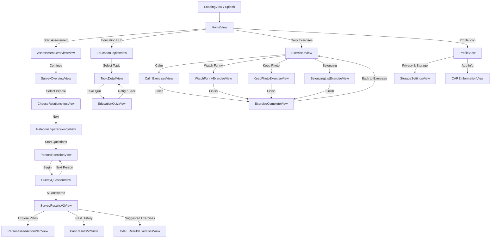

# CARE App — Complete Route Map & Screen Visualizer

This document maps all active routes in **CARE App**, their entry triggers, visual files, and destination transitions.

---

## 1. Visual Route Hierarchy

---

## 2. Exhaustive Route Inventory Table

| Route (`AppRoute` Case) | View File | Purpose / Description |
| :--- | :--- | :--- |
| `.loading` | `Views/LoadingView.swift` | Initial brand splash screen with fade animation |
| `.home` | `Views/HomeView.swift` | Main dashboard with streak calendar, modules & active drafts |
| `.assessmentOverview` | `Views/AssessmentOverviewView.swift` | Assessment orientation & explanation screen |
| `.surveyOverview` | `Views/SurveyOverviewView.swift` | Breakdown of relational dimensions being assessed |
| `.chooseRelationships` | `Views/ChooseRelationshipsView.swift` | Multi-select relationships from contacts or custom inputs |
| `.relationshipFrequency` | `Views/RelationshipFrequencyView.swift` | Assign percentage time spent per relationship |
| `.personTransition` | `Views/PersonTransitionView.swift` | Interstitial transition focusing on individual contact |
| `.surveyQuestion` | `Views/SurveyQuestionView.swift` | 20-question survey per person with sticky action bar |
| `.surveyResultsV2` | `Views/SurveyResultsV2View.swift` | Modern results screen with 4-line CARE chart & donuts |
| `.pastResultsV2` | `Views/PastResultsV2View.swift` | Historical assessment comparisons & trend charts |
| `.personalizedActionPlan` | `Views/PersonalizedActionPlanView.swift` | Clinical guidance and 'Wired to Connect' book integration |
| `.education` | `Views/Education/EducationTopicsView.swift` | Hub for 6 psychoeducation neuroscience topics |
| `.educationDetail(topic)` | `Views/Education/TopicDetailView.swift` | In-depth topic reader with pathways and clinical founders |
| `.educationQuiz(topic)` | `Views/Education/EducationQuizView.swift` | 3-question mastery quiz with pseudorandom bank |
| `.exercises` | `Views/ExercisesView.swift` | Exercises catalog with category filter & daily tracker |
| `.calmExercises` | `Views/CalmExercisesView.swift` | Somatic soothing & vagal nerve regulation exercise |
| `.watchFunny` | `Views/WatchFunnyExerciseView.swift` | Shared laughter & dopamine boosting exercise |
| `.keepPhoto` | `Views/KeepPhotoExerciseView.swift` | Visual memory anchor connection exercise |
| `.belongingList` | `Views/BelongingListExerciseView.swift` | Relational network mapping & gratitude exercise |
| `.exerciseComplete` | `Views/ExerciseCompleteView.swift` | Celebration card & habit streak logger |
| `.profile` | `Views/ProfileView.swift` | User identity, biometric lock toggle & preferences |
| `.careInfo` | `Views/CAREInformationView.swift` | Jean Baker Miller Institute & clinical citations |
| `.addRelationship` | `Views/AddRelationshipView.swift` | Add new contact with category, age, and nickname |
| `.welcomeAccountSetup` | `Views/WelcomeAccountSetupView.swift` | First-time onboarding & profile setup |
| `.careResultsExercises` | `Views/CAREResultsExercisesView.swift` | Targeted exercises mapped to low-scoring dimensions |
