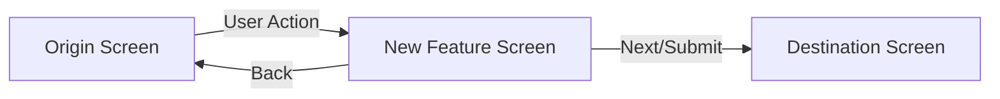

# Tracer Bullet PRD: [Feature Title]

* **Author**: Jayme & Codex
* **Date**: [YYYY-MM-DD]
* **Target Release / Route**: `AppRoute.[newRouteName]`
* **Status**: Approved for Implementation

---

## 1. Executive Summary & User Problem
[2-3 sentences explaining what user need this solves and the emotional/clinical rationale from Relational Cultural Theory.]

---

## 2. User Journey & Navigation Flow

* **Entry Point**: User arrives at this screen from `[Origin Screen / AppRoute]`.
* **Action Trigger**: User taps `[Button / Card Label]`.
* **Exit Point (Forward)**: On completion, routes to `[Destination Screen / AppRoute]`.
* **Exit Point (Backward)**: On back button tap, routes to `[Previous Screen / AppRoute]`.



---

## 3. UI Component Architecture

1. **Header**: `HeaderNavBar` with title `"[Screen Title]"` and back action.
2. **Main Content**:
   - Component A: `[e.g. Card, text, input]`
   - Component B: `[e.g. List, selector]`
3. **Sticky Action Bar**: `PrimaryButton` with title `"[Continue/Submit]"`.

---

## 4. Acceptance Criteria (Gherkin Format)

```gherkin
Scenario: Happy Path Navigation
  Given the user is on "[Origin Screen]"
  When they tap "[Button Label]"
  Then they navigate to "[New Feature Screen]"
  And the route stack reflects ".[newRouteName]"

Scenario: Data Submission
  Given the user has completed the required inputs
  When they tap "[Submit Button]"
  Then the state is saved to the local repository
  And the user is transitioned to "[Destination Screen]"

Scenario: Back Navigation Integrity
  Given the user is on "[New Feature Screen]"
  When they tap the back chevron
  Then they return to "[Origin Screen]" without loss of prior state
```

---

## 5. Non-Functional & Boundary Invariants

* **WCAG AA Compliance**: All text contrast >= 4.5:1; touch targets >= 44x44pt.
* **Offline First**: All actions succeed without internet access.
* **Out of Scope**: [Explicitly list what is NOT in this iteration].
